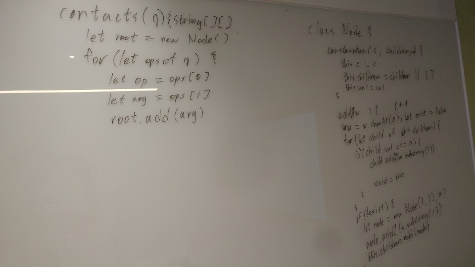
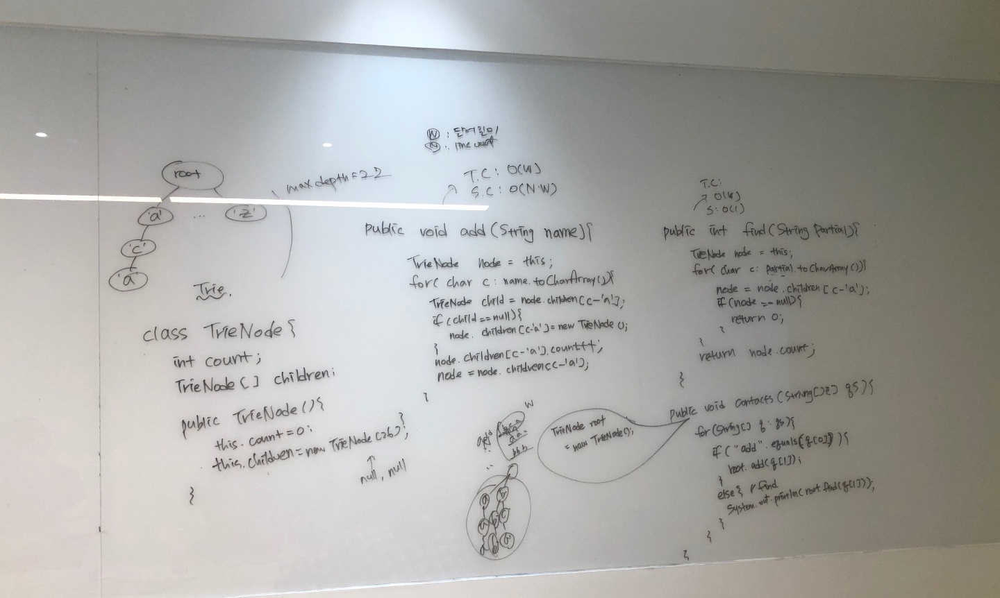
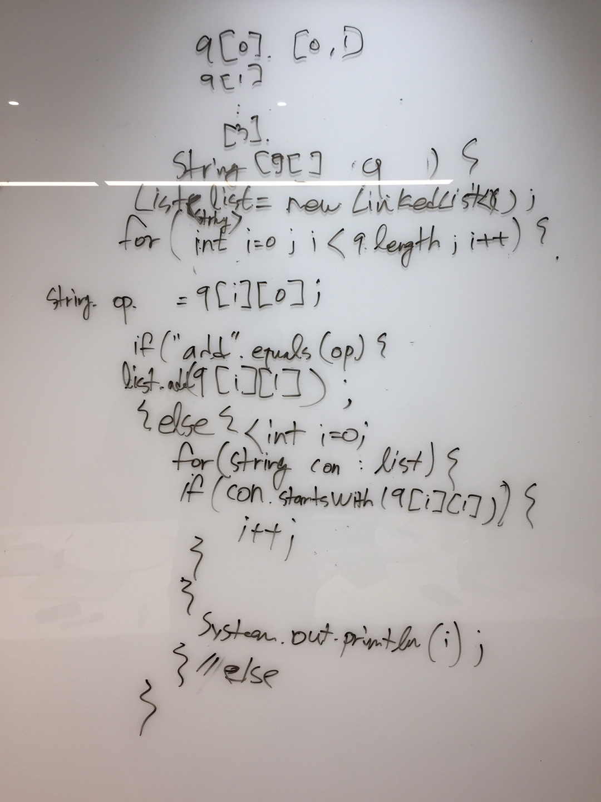
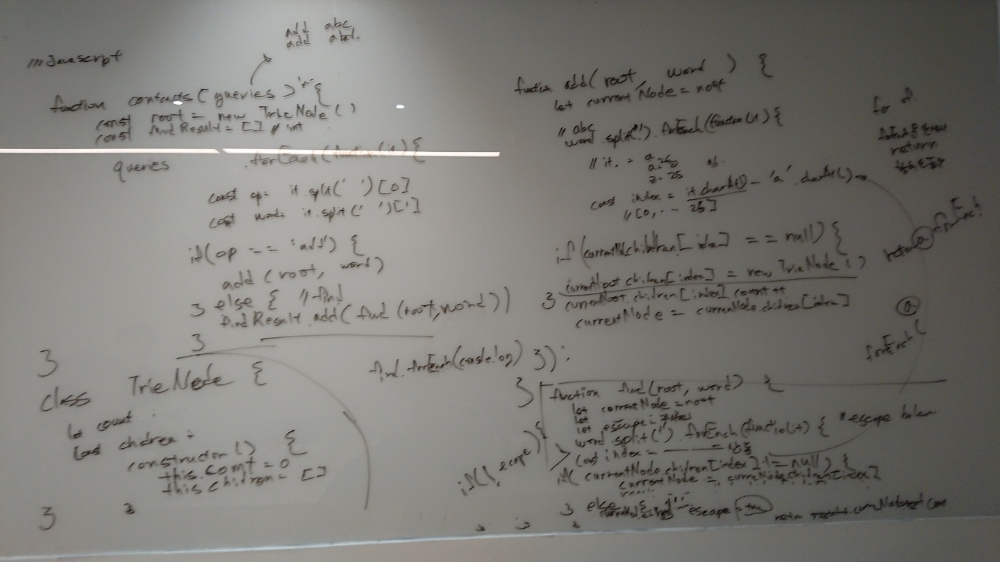

# 2회차 스터디

2019.01.13(일) 09:00

김지훈 진행


## 문제
[contacts](https://www.hackerrank.com/challenges/contacts/problem)


## 원숭이들의 생각
### 경원님

* 트리 문제라고 무조건 재귀적으로 풀려고 할 필요는 없는 것 같다. 이번 문제처럼 경우에 따라서는 이터레이션하게 푸는 것도 생각해보는게 좋을 것 같다.
* 손코딩에 약한 것 같다. 자꾸 오타가 나고 이전에 작성한 것을 수정하게 된다.
* 기존에 공부했던 기초적인 자료구조들을 다시 한번 구현해보자.
* [after code(재귀를 사용해서 풀이)](https://gist.github.com/kwSeo/5374ca2f01cc12209cf092bb21965f92)

### 아리님

* TrieNode의 children[index]가 null일 경우 새로운 TrieNode()를 할당해주는 곳에 버벅였다. 조금 아쉬운 부분. 
* 재밌는 문제였다. 지난 번엔 혼자 해커랭크에서 풀었지만, 이번에는 컨디션도 안좋고 화이트보드 앞에서 코딩하다 보니 손이 매우 떨리고 횡설수설 했다.
* 다른 사람들 앞에서 푼다는 것은 정말 좋은 연습이었던 듯.


### 경훈님

* 오늘 푼, 문자검색 알고리즘에 대한 컨셉개념이 아예 없었다. 단순한 list & string compare 라니!
* 단순히 brutal force 로 푸는것이 아닌, 스마트함을 보여줄수 있는 컨셉을 찾아내자.
    * 단순히 완성만 하는것은 큰 의미가 없을수 있다.
    * 많이 풀어서 유형에 좀 익숙해 질 필요가 있다.

### 지훈님

* javascript 함수 동작 설명을 매끄럽게 하지 못했다.
* 함수형 스타일의 장점을 살리지 못한 것 같다.
* t.c, s.c 를 설명할때, 펑션별로 나눠서 설명하는게 좋아보인다.
* 내 구현이 햇갈릴때는 의도를 다시 이야기하고(전달하고), 테스트 케이스를 적어보자
    * 테스트 set은 다른색 마커로 쓰면 잘보인다.


## 우리가 생각하는 최적의 솔루션

Kotlin 버전으로 하면 아래와 같다.
```kotlin
private val Char.index: Int
    get() = this - 'a'

class TrieNode {
    val children = arrayOfNulls<TrieNode?>(26)
    var cnt = 0

    fun add(c: Char): TrieNode {
        if (children[c.index] == null) children[c.index] = TrieNode()
        children[c.index]!!.cnt++
        return children[c.index]!!
    }

    fun find(c: Char) = children[c.index] ?: TrieNode()
}

class Trie {
    private val root = TrieNode()

    fun add(s: String) {
        var currentNode = root
        s.forEach { currentNode = currentNode.add(it) }
    }

    fun find(s: String): Int {
        var currentNode = root

        s.forEach {
            currentNode = currentNode.find(it)
        }

        return currentNode.cnt
    }
}

fun main(args: Array<String>) {
    val n = readLine()!!.toInt()
    val root = Trie()

    for (i in 1..n) {
        val (op, s) = readLine()!!.split(" ")
        when (op) {
            "add"  -> root.add(s)
            "find" -> println(root.find(s))
        }
    }
}
```
#### 복잡도
* 입력받은 문자열의 길이를 m, 반복회수를 n일때
* add function
    * 시간 복잡도: O(nm)
    * 공간 복잡도: O(nm)
* find function
    * 시간 복잡도: O(nm)
