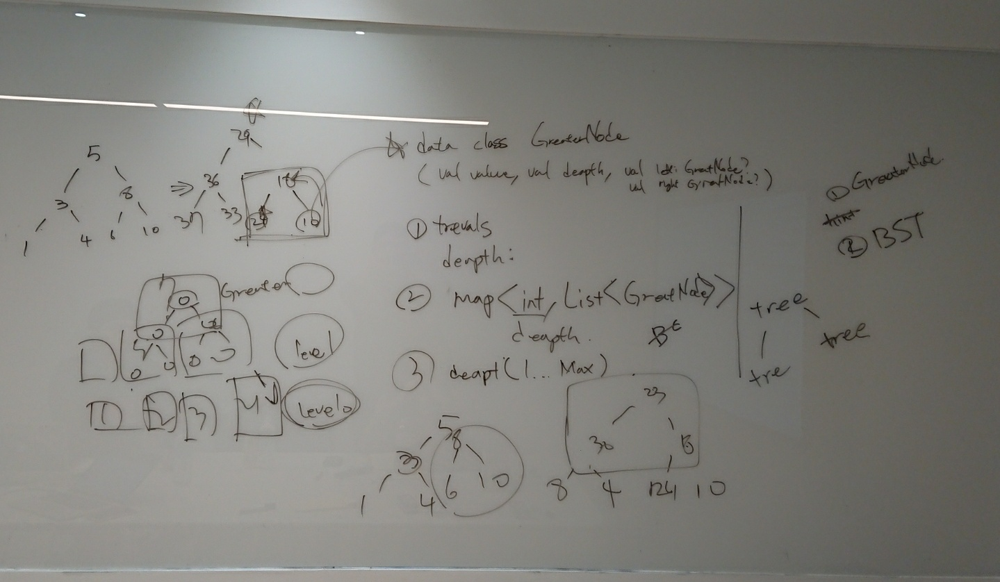
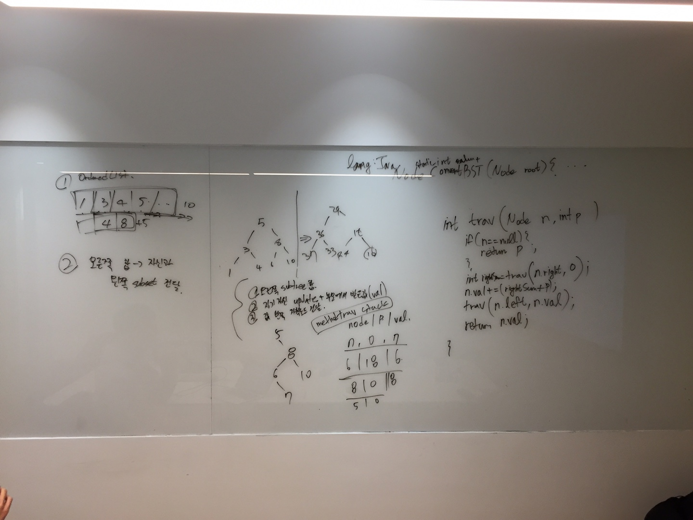

# 3회차 스터디

2019.01.19(월) 09:00

서경원 진행


## 문제

[Convert BST to Greater Tree](https://leetcode.com/problems/convert-bst-to-greater-tree)


## 원숭이들의 생각

### 아리님

```java
class Solution {
    public TreeNode convertBST(TreeNode node) {
        convert(node, 0);
        return node;
    }
    
    private int convert(TreeNode node, int acc) {
        if(node == null) {
            return acc;
        }
      	int right = (node.right == null) ? 0 : convert(node.right, acc);
        node.val += right + acc;
        return convert(node.left, node.val);
    }
}
```

- testcase를 먼저 설명해주면서 visualize 하는 것이 좋았다.
- 재귀 호출 할때 써준 것은 좋았는데, 화살표 보다는 stack trace로 표현해주면 더 좋았을 것 같다.
- 최대한 accumulated value를 parameter로 받아보는 방법으로 풀려고 했는데, left의 right의 right 노드를 디버깅 하다보니, `node.val += right + acc`에서 right와 acc의 차이가 node.val이어서 결국 두 번 더해지는 경우가 있었다. 그래서 멘붕했다. 그 이후로 멘탈 복귀가 어려웠음. 차분히 생각하려 해도 잘 안되더라.
- 재귀 stack trace 따라가는게 생각보다 헷갈린다.
- java에 AtomicInteger라는게 있다!


#### 추후 개선된 코드

```java
class Solution {
    public TreeNode convertBST(TreeNode node) {
        convert(node, 0);
        return node;
    }
    
    private int convert(TreeNode node, int acc) {
        if(node == null) {
            return acc;
        }
        node.val += convert(node.right, acc);
        return convert(node.left, node.val);
    }
}
```

노드의 갯수가 N 개라 할 때,
Time complexity: O(N)
Space complexity: O(log N) (O(N) when the worst case)


### 지훈님



* function 시그니쳐를 먼저 적어놓으면 어떨까?
    * function 시그니쳐를 기반으로 콜스택을 설명하면 어떨까
        * 이게 의도대로 될까?
        * input, 행위, output
* 잘못된 풀이로 들어왔을때, 주화입마에 빠져버린다.
* 주어진 노드를 다른 노드로 변형하려했는데, 안 좋은 습관인듯
* 문제가 BST 라고 했으면 분명히 힌트일텐데, 캐치하지 못했다.
* 화이트 보드 코딩을 진행하는 여러 방법이 있을텐데
    * 오답이나 산으로 가는 솔류션일지라도 코딩을 해야함
* 시간 안배가 안된다. 시간을 효율적으로 쓰자
    * 시간 안배가 안된경우, 내 설계의도를 잘 이야기 하자
* 문제 풀다가 꼬인 케이스일경우, 면접관과 적극적인 커뮤니케이션을 찾자
    * 문제 풀다가 틀렸을때는, 틀렸다고 느낀 경우 짧게 시인하고 새 솔루션을 찾자
* 멘탈이 바스라졌을때 탈출이 안된다.
    * 모르면 그냥 물어본다. 어짜피 떨어질거...
* 다음주 엑션 포인트
    * **알고리즘 표기법 짧게 설명하기**


### 경훈님



* 알고리즘 컨셉잡기 : 1차 SortedList 로 생각하여, 2차 subset sum 으로 개념전개 매우 좋았음
* 코딩 : 머릿속에서 function parameter(signiture) / return 개념을 명확히 잡지 못한상태로 진행하다 헷갈리면 늪에 빠진다. 시작하기 전에 parameter/return 에 대해 꼭 한번 생각하고 시작하자
* 풀이 : 
  - method stack을 적는것은 좋았으나, 원본트리를 카피하여 변해가는 값을 직접 적으면 좋겠다.
* after 정답like 풀이 :
  - static variable 을 사용하는것을 적절히 고려하자, 굉장히 심플하게 풀수 있다. but 알고리즘에선 안티패턴으로 간주할 수도 있다. (그래도 못푸는것보단 푸는게 낫지 않을까?)
  - (경원님 link 풀이 후) 문제의 본질을 이용하여, 원래 형태와 다르게 조작 & 생각할수도 있겠다, 문제를 풀고 시간이 남으면(그럴일은 별로 없겠지만..) 더 신박한 방법을 생각해보자 !


### 경원님

```java
class Solution {
    public TreeNode convertBST(TreeNode root) {
        convert(root, new AtomicInteger(0));
        return root;
    }

    public void convert(TreeNode node, AtomicInteger sum) {
        if (node == null) {
            return;
        }

        convert(node.right, sum);
        node.val = sum.addAndGet(node.val);
        convert(node.left, sum);
    }
}
```

* 설명할때 예제 케이스를 미리 그려놓고 로직 흐름에 따라서 어떻게 변해가는지 조금씩 수정해나가면 좋을 것 같다.
* 재귀적인 로직을 설명할때 메모리 구조(heap, stack)을 함께 그려서 설명하면 좋은 것 같다.
* 작성된 로직을 보다 효율적으로 설명할 수 있는 방법들을 생각해보자.


## 최적의 솔루션

### AtomicInteger를 활용한 솔루션

```java
class Solution {
    public TreeNode convertBST(TreeNode root) {
        convert(root, new AtomicInteger(0));
        return root;
    }

    public void convert(TreeNode node, AtomicInteger sum) {
        if (node == null) {
            return;
        }

        convert(node.right, sum);
        node.val = sum.addAndGet(node.val);
        convert(node.left, sum);
    }
}
```

* 시간 복잡도: O(n)
* 공간 복잡도: O(n)

### 반환값을 활용한 솔루션

```java
class Solution {
    public TreeNode convertBST(TreeNode node) {
        convert(node, 0);
        return node;
    }
    
    private int convert(TreeNode node, int acc) {
        if(node == null) {
            return acc;
        }
        node.val += convert(node.right, acc);
        return convert(node.left, node.val);
    }
}
```

* 시간 복잡도: O(n)
* 공간 복잡도: O(n)

### node link 연결을 통한 솔루션: Reverse Morris In-order Traversal

* 출처 leetcode solution
  * 보다 자세한 설명은 위 문제 링크의 solution 탭 참고

```java
class Solution {
    /* Get the node with the smallest value greater than this one. */
    private TreeNode getSuccessor(TreeNode node) {
        TreeNode succ = node.right;
        while (succ.left != null && succ.left != node) {
            succ = succ.left;
        }
        return succ;
    }

    public TreeNode convertBST(TreeNode root) {
        int sum = 0;
        TreeNode node = root;

        while (node != null) {
            /* 
             * If there is no right subtree, then we can visit this node and
             * continue traversing left.
             */
            if (node.right == null) {
                sum += node.val;
                node.val = sum;
                node = node.left;
            }
            /* 
             * If there is a right subtree, then there is at least one node that
             * has a greater value than the current one. therefore, we must
             * traverse that subtree first.
             */
            else {
                TreeNode succ = getSuccessor(node);
                /* 
                 * If the left subtree is null, then we have never been here before.
                 */
                if (succ.left == null) {
                    succ.left = node;
                    node = node.right;
                }
                /* 
                 * If there is a left subtree, it is a link that we created on a
                 * previous pass, so we should unlink it and visit this node.
                 */
                else {
                    succ.left = null;
                    sum += node.val;
                    node.val = sum;
                    node = node.left;
                }
            }
        }
        
        return root;
    }
}
```

* 시간 복잡도: O(n)
* 공간 복잡도: O(1)