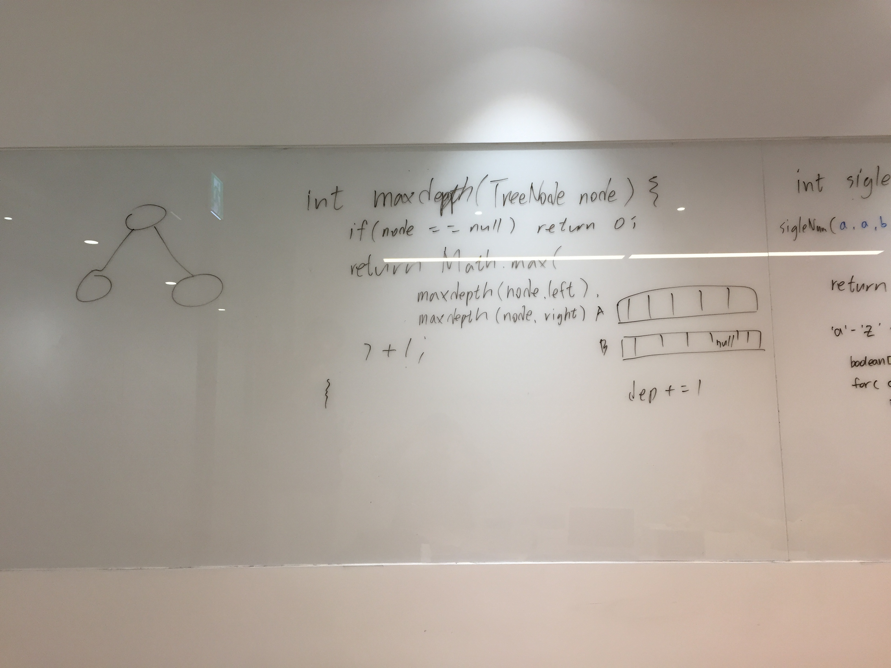
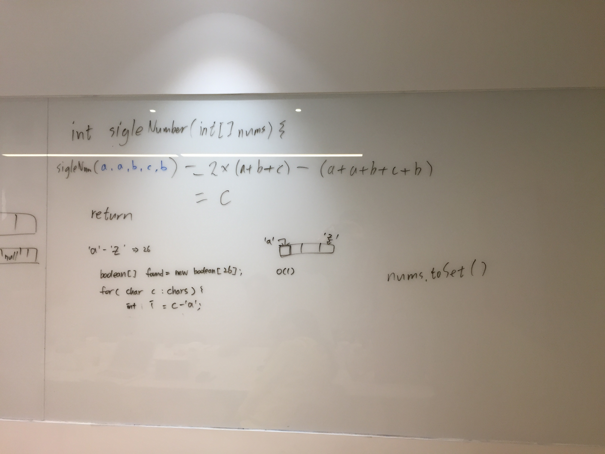

# 4회차 스터디

2019.02.02(토) 09:00

전경훈 진행

## 문제

1번 - [Maximum Depth of Binary Tree](https://leetcode.com/problems/maximum-depth-of-binary-tree)
2번 - [Single Number](https://leetcode.com/problems/single-number/)

## 원숭이들의 생각

### 아리님
* Max depth of binary tree 문제를 재귀적으로 푸는건 쉬우니, iterative 하게 풀어보자 해서, 논리를 설명하는데 queue의 동작을 생각하면서 stack이라 내뱉고 코드까지 작성했다. 조금 더 정신을 차릴 필요가 있겠다.
* single number in array 문제를 풀 때에는 전에 풀어봤던 거라 XOR로 접근하는 방식을 소개했으나, 너무 빠른 최적의 솔루션 전개에 자신감은 있어보이나 이걸 풀어본건지.. 뭔지.. 하는 마음에 다른 문제를 물어봄. 로직 전개에 있어서 소통이 부족했다.
* single number 에서 수식으로 로직을 도출하는 방식이 색달랐다. 경원님 짱.
* 생일이 2주 지났는데에도 축하받았다. 여러분 짱.

### 지훈님

* 문제를 다양한 방법으로 고민하는게 필요하다.
* 어떻게 풀지 설명하고, 예제를 보여준 후, 예상 값을 적고 시작하자
* 아직 문제를 한참 많이 풀어봐야 할 것 같음. 아는 문제가 적다.
* 힌트를 잘 보자.
    * 힌트를 무시하는 경향이 있는 것 같다.
* 논리 연산 짱짱맨인듯

### 경훈님
1번 : Depth of Binary tree
2번 : Single Number
* 알고리즘 컨셉잡기 : 1번 문제는 쉽게 컨셉을 잡았으나, 두번째 문제는 아예 컨셉을 잡지 못했다. 원인은 너무 자료구조 측면에서 고민한것 같다. 수학적으로도 고려해보자 !
* 코딩 : 1번문제는 한방에 잘 풀었음, 2번문제는 Solution을 보고 원리를 이해하여 복기하며 잘 코딩함 
* 총평 : 
  - 2문제를 시간내 풀어내는것은 시간분배차원 & 늪에 빠지는 차원에서 많은 연습이 필요하다.
  - 자료구조를 다시 빡세게 공부하고, 어떤 case에 적용해 볼수 있을지 공부하자.

### 경원님
* 알고리즘의 시간/공간 복잡도에 대해서 물어볼 수 있다. 빅오, 세타 등의 표현법을 정확히 알고 있을 필요가 있다. 
* 공간/시간 복잡도의 input에 대해서 서로 다른 의견을 가지고 있을 수 있다(예를 들어, 재귀적인 로직에서 함수 콜 스택도 공간복잡도에 포함해야하나?). 시간/공간 복잡도에 대해서 말할때 시간과 공간의 범위를 서로 명확히 할 필요가 있다.
* 이미 알고 문제라고해서 아무런 의사소통 및 고민없이 바로 풀어버리면 오히려 역효과가 날 수 있다. 솔직하게 이미 알고 있는 문제이니 다른 문제를 달라며 자신감을 보이는게 좋을 수도 있다(아니면 적당히 모른척하면서 진행...?)
* 만일 문제가 수식적으로 해결될 것 같다면 수식을 먼저 정리해보자.
* 종종 논리연산(and, or, xor 등)이 매우 유용할때가 있다. 부울식을 다시 한번 정리해보자.
* 설명할때 예제 케이스를 미리 그려놓고 로직 흐름에 따라서 어떻게 변해가는지 조금씩 수정해나가면 좋을 것 같다.
* 재귀적인 로직을 설명할때 메모리 구조(heap, stack)을 함께 그려서 설명하면 좋은 것 같다.
* 작성된 로직을 보다 효율적으로 설명할 수 있는 방법들을 생각해보자.

