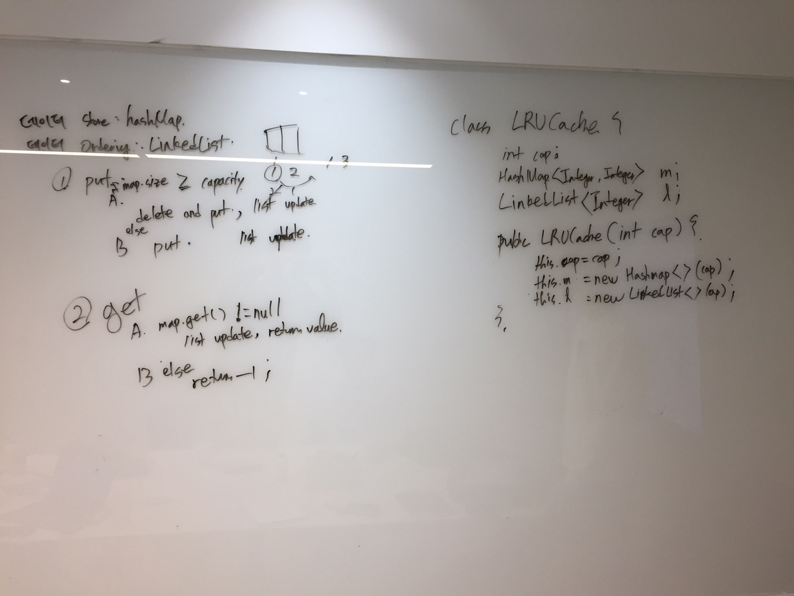
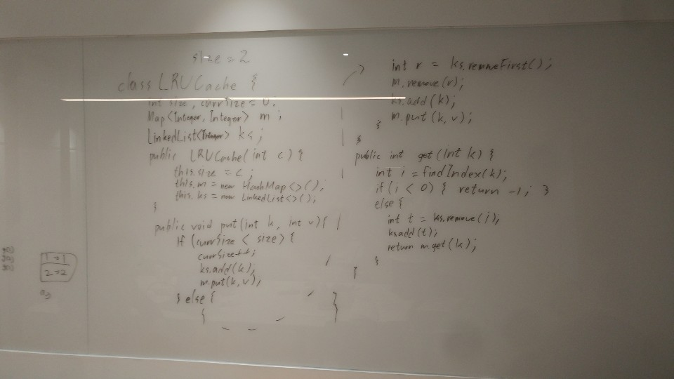
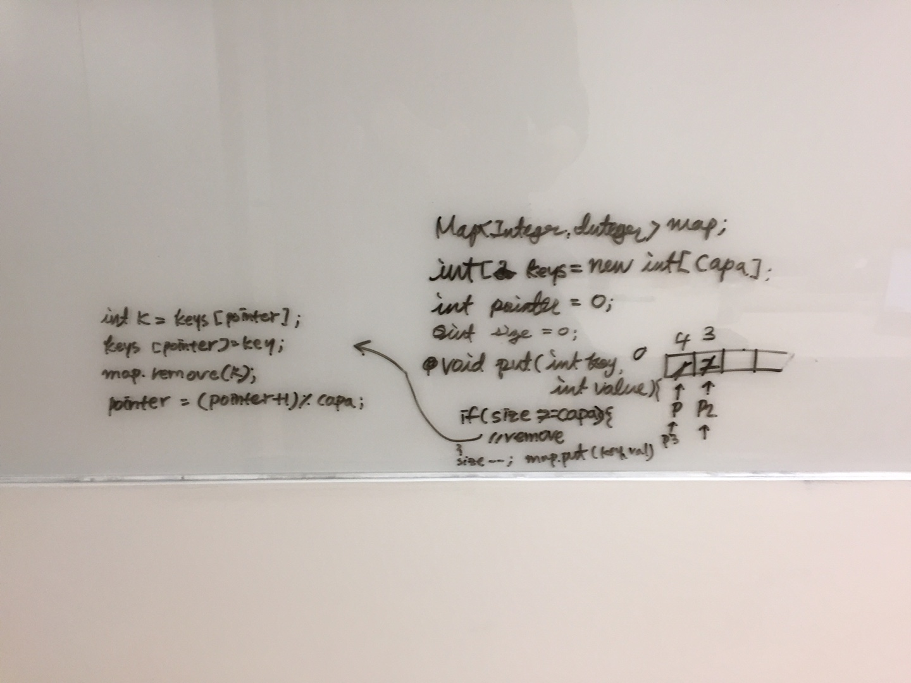

# 5회차 스터디
2019.02.09
오아리 진행

## 문제
https://leetcode.com/problems/lru-cache/

## 원숭이들의 회고

### 지훈스


* 문제를 보고 자료구조를 잘 생각해보자. 경우에 따라서는 여러 자료구조가 복합적으로 적용될 수 있다.
    * 생각해내기 어렵다면, 기억나는 자료구조를 모두 꺼내 문제랑 매칭시켜보자
* 예제를 잘 적어보자.
    * 잘 안풀린다면 예제가 구릴 수도
    * 잘 풀리는 경우라도 예제가 편협하게 설정되어있을 수도 있다
* 여전히 문제의 의도를 잘 파악하지 못하는 것 같다.
    * 조급하게 보지 말고 천천히 힌트를 확인하자
    
### 경원스

자료구조를 각각 독립적으로 생각하지 말자. 자료구조는 조합해서 사용하면 보다 효율적으로 사용하고 있다.
* 각 자료구조와 특징과 장점을 잘 이해하고 있을 필요가 있다. 각 자료구조를 조합함으로써 각 자료구조의 장점을 살리고 단점을 줄일 수 있다.
* 때때로 사용하는 프로그래밍 언어에서 제공하는 자료구조 유틸만으로는 기능을 2% 부족할 수 있다. 이때 필요한 핵심 기능만을 직접 구현할 필요가 있을 수 있으니 기본적으로 많이 사용되는 자료구조는 별다른 고민시간없이 뚝딱 작성할 수 있을 필요가 있다.
* heap 자료구조가 잘기억이 나지 않는다. 다시한번 공부해보자. 많이 사용되는 자료구조를 C언어 외에 다른 언어로 다시 구현해보자.

### 경훈스

* 알고리즘 컨셉잡기 : LinkedList 를 이용한 Data ordering 컨셉을 잘 잡았다. 문제에서 추가조건이였던 O(1) 을 만족하지는 못하였지만, iterable 하게 풀어내었다. O(n)
* 코딩 : if else 케이스를 처음에 확실하게 생각하지 못한상태로 코딩하니 코드블락이 중구난방이 되었다. if-else concept을 먼저 확실히 생각하고 손코딩하자.
* 총평 : 
  - leetcode에서 hard 문제 처음도전하였는데, 내가 기존에 알던 지식만으로는 전혀 생각할수 없는 컨셉의 문제였다.
  - O(1) 솔루션을 본 후 -> 문제의 핵심이라고 생각했던 O(1) 솔루션인 linkedList(node)를 map으로 searching 하는 아이디어... 단순 경험차원이 아닌, 이 문제의 본질이라고 생각하는것에 더욱 깊게 파고들자.
  
### 아리스

* Time complexity가 O(N)으로 동작하는것으로 처음 생각을 했었다. key의 순서를 singly linked list로 관리하고, get/put 호출이 올 때마다 해당되는 키 값을 뒤로(recently used) 보내고, put에서는 capacity가 꽉 찼을 경우 list의 head 값을 삭제하고, map에서도 삭제하면 된다고 생각했다.

* Time complexity를 O(1)로 줄일 수는 없을까?
  * Singly linked list 대신 key를 담고 있는 array와 pointer를 사용하려고 시도했다. pointer가 가리키는 곳에 key를 담는 것, capacity가 꽉찼을 경우 pointer가 가리키는 곳의 key를 맵에서 삭제하고 새로운 key를 담는 방법을 생각했는데, 그럼 정확히는 O(1)이 아니었다. 그리고 제대로 동작하지 않았다. 왜냐하면, capacity=3인 상황에서 put(1)->put(2)->put(3)->get(3)을 하게 되면 3을 다시 배열 안에서 searching 해야하기 때문이다. 게다가 찾은 키를 맨 앞(index at 0)으로 이동시키는 과정에서의 소요 시간도 필요하기 때문에 오히려 singly linked list로 관리하는게 더 낫다.

* 멘붕의 시간 도중 엄청난 솔루션을 발견 했다.
[링크 참고](https://leetcode.com/problems/lru-cache/discuss/45911/Java-Hashtable-%2B-Double-linked-list-(with-a-touch-of-pseudo-nodes))

* Doubly linked list로 head는 recently used, tail은 leas recently used의 순서로 되어있다. LRU cache 클래스 내부에서는 head와 tail을 항상 가지고 있다. 리스트의 중간에 낀 node를 찾을 때가 문제인데, 그 것을 hashmap을 통해 관리하면 get의 time complexity를 O(1)로 줄일 수 있다. HashMap <key, DoubleListNode> 을 통해 관리하는 것이 키포인트!
  * 키포인트 1. Doubly Linked List를 사용한다.
  * 키포인트 2. DLL의 get time complexity를 줄이기 위해 hash map을 사용한다.

어떻게 이렇게 생각할 수 있는건지 놀랍기만 할 따름.. 열심히합시다!
역시 hard는 어렵다. 얕잡아 보지 말것 ㅠ

## 최적의 솔루션
[엄청난 솔루션](https://leetcode.com/problems/lru-cache/discuss/45911/Java-Hashtable-%2B-Double-linked-list-(with-a-touch-of-pseudo-nodes))
```java
class DLinkedNode {
  int key;
  int value;
  DLinkedNode pre;
  DLinkedNode post;
}

/**
 * Always add the new node right after head;
 */
private void addNode(DLinkedNode node){
  node.pre = head;
  node.post = head.post;

  head.post.pre = node;
  head.post = node;
}

/**
 * Remove an existing node from the linked list.
 */
private void removeNode(DLinkedNode node){
  DLinkedNode pre = node.pre;
  DLinkedNode post = node.post;

  pre.post = post;
  post.pre = pre;
}

/**
 * Move certain node in between to the head.
 */
private void moveToHead(DLinkedNode node){
  this.removeNode(node);
  this.addNode(node);
}

// pop the current tail. 
private DLinkedNode popTail(){
  DLinkedNode res = tail.pre;
  this.removeNode(res);
  return res;
}

private Hashtable<Integer, DLinkedNode> 
  cache = new Hashtable<Integer, DLinkedNode>();
private int count;
private int capacity;
private DLinkedNode head, tail;

public LRUCache(int capacity) {
  this.count = 0;
  this.capacity = capacity;

  head = new DLinkedNode();
  head.pre = null;

  tail = new DLinkedNode();
  tail.post = null;

  head.post = tail;
  tail.pre = head;
}

public int get(int key) {

  DLinkedNode node = cache.get(key);
  if(node == null){
    return -1; // should raise exception here.
  }

  // move the accessed node to the head;
  this.moveToHead(node);

  return node.value;
}


public void set(int key, int value) {
  DLinkedNode node = cache.get(key);

  if(node == null){

    DLinkedNode newNode = new DLinkedNode();
    newNode.key = key;
    newNode.value = value;

    this.cache.put(key, newNode);
    this.addNode(newNode);

    ++count;

    if(count > capacity){
      // pop the tail
      DLinkedNode tail = this.popTail();
      this.cache.remove(tail.key);
      --count;
    }
  }else{
    // update the value.
    node.value = value;
    this.moveToHead(node);
  }

}
```
