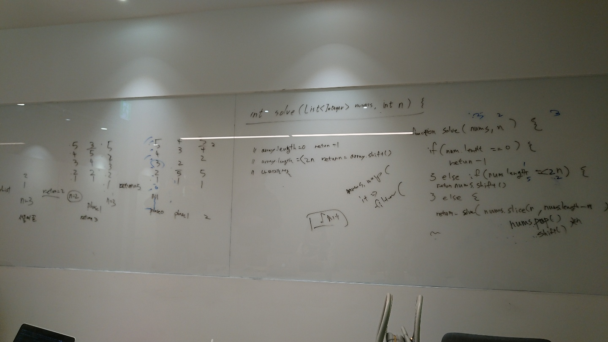
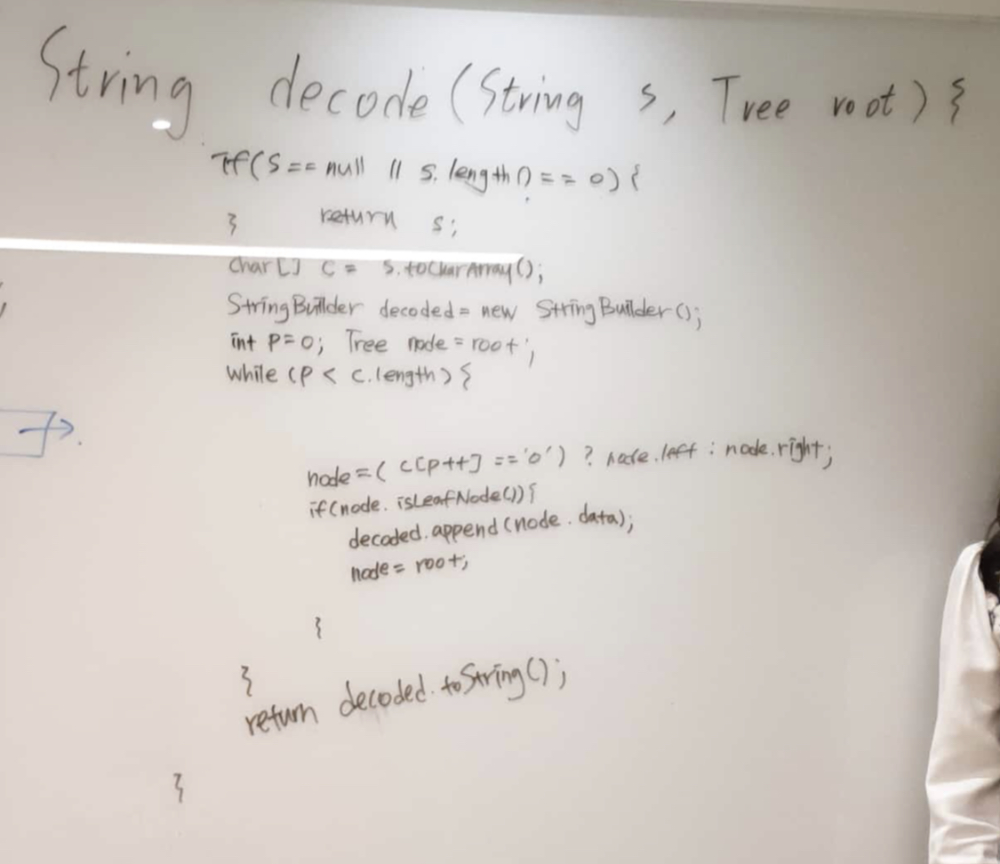
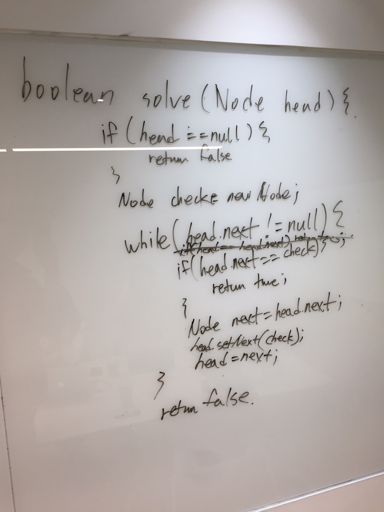

# 6회차 스터
2019.03.16
서경원 진행

## 문제
각자 다른 문제!!

## 원숭이들의 회고
### 지훈님
#### 푼 문제: number shuffle
0부터 100사이의 숫자가 주어졌을 때
n번 shuffle을 수행하고 나서 가장 앞에 있는 숫자는 무엇인가?
카드를 선택할 수 없다면 -1을 반환한다.

shuffle 방법 - numbers = 1~10, n = 2
- 1 2 3 4 5 6 7 8 9 10
- 3 4 5 6 7 8 1 2 9 10
- 5 6 3 4 7 8 1 2 9 10
- return 5



#### 후기
* 오늘 쉬운 문제 걸림
* if 문 condition에서 살짝 뇌절이 옴
    * 햇갈리면 샘플을 적자
* 문제 자체가 함정일 수 있다. 재귀일지, 이터레이터일지.
* 문제의 사전조건을 확인하는 것은 잘 했다.
* 힌트주면 바로 다음거로 남은거로 넘어가자.(힌트 주면 니꺼 지금 잘못하고있는거임)

### 아리님
#### 푼 문제: 허프만 디코딩
허프만 트리와 허프만 인코딩된 코드가 주어졌을때 디코딩을 수행하는 함수를 구현하시오.

**허프만 트리 노드**
```java
class Node {
      public int frequency;
      public char data;
      public Node left, right;
}
```



#### 후기
- 허프만 트리만 듣고 좌절할 뻔 했다.
- 1101이 있을때, 1만 쪼개야 하나 11로 쪼개서 디코딩을 해야하나 헷갈렸는데, 허프만 트리의 특징을 다시 한 번 상기하니 겹칠 일이 없다는 것을 알게됐다.(이건 좀 짱인듯)
- 평소라면 못풀었을 문제인데, 그날은 왜인지 모르게 잘 풀렸다. 꾸준함의 효과인가! 라는 자만감과 함께 퇴장..

### 경훈님
#### 푼 문제: 순환 리스트 체크
리스트가 있을 때 순환 리스트인지 확인하는 함수를 작성하시오.

**리스트 노드**
```java
class ListNode {
    int value;
    ListNode next;
}
```



#### 후기
- Case 정리를 잘 하자, closed, self-one-node-cycle 등
- mutable 조건을 체크하자. 처음 생각한 Set 이외에 방법은 모두 mutable 조건이였다.

### 최적의 솔루션
#### number shuffle
```java
public int solve(List<Integer> nums, int m) {
    if (nums == null) {
        return -1;
    }
    int size = nums.size();
    if (size == 0) {
        return -1;
    } else if (size <= m * 2 || m == 0) {
        return nums.get(0);
    } else {
        return solve(nums.subList(m, size - m), m);
    }
}
```

#### 허프만 디코딩
```java
String decode(String s, Node root) {
  StringBuilder sb = new StringBuilder();
  Node current = root;
  for (char ch : s.toCharArray()) {
      if (ch == '0') {
          current = current.left;
        } else {
          current = current.right;
        }

      if (current.left == null && current.right == null) {
          sb.append(current.data);
          current = root;
        }
    }
  return sb.toString();
}
```

#### 순환 리스트 체크
```java
public boolean solve(ListNode items) {
    ListNode faster = items, slower = items;
    while (faster != null && faster.next != null) {
        faster = faster.next.next;
        slower = slower.next;
        if (faster == slower) {
            return true;
        }
    }
    return false;
}
```