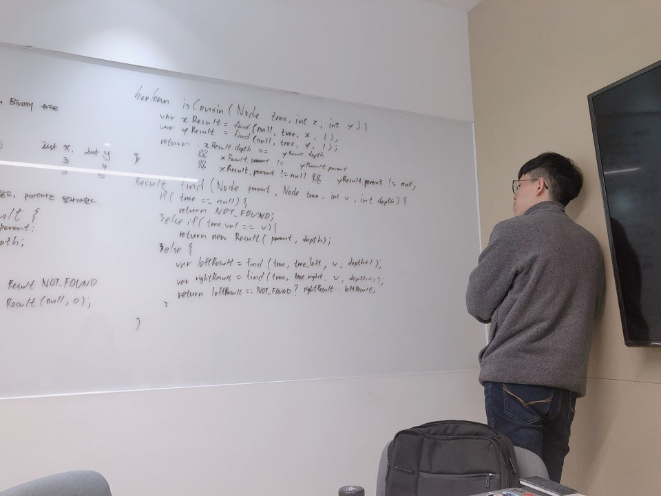

# 9회차 스터디
2019.04.06 오아리 진행

# 문제
세 문제를 화이트보드에 적은 뒤, 각자 한 문제씩 선택하여 종이에 적는 시간 없이 바로 문제 풀이 진행.
- [Cousins in Binary Tree](https://leetcode.com/problems/cousins-in-binary-tree/)
- [Trim BST](https://leetcode.com/problems/trim-a-binary-search-tree/)
- [factorial-trailing-zeroes](https://leetcode.com/problems/factorial-trailing-zeroes)

# 원숭이들의 생각
## 경원님



### Problem

[한 트리 내에 주어진 두 노드는 사촌 노드인가?](https://leetcode.com/problems/cousins-in-binary-tree/)

### Solution
```java
public static final Result NOT_FOUND = new Result(null, 0);  
  
public boolean isCousins(TreeNode root, int x, int y) {  
  Result xResult = find(null, root, x, 1);  
  Result yResult = find(null, root, y, 1);  
  return xResult.parent != null  
	  && yResult.parent != null  
	  && xResult.parent != yResult.parent  
	  && xResult.depth == yResult.depth;  
}  
  
Result find(TreeNode parent, TreeNode node, int v, int depth) {  
  if (node == null) {  
	  return NOT_FOUND;  
  } else if (node.val == v) {  
	  return new Result(parent, depth);  
  } else {  
	  Result leftResult = find(node, node.left, v, depth + 1);  
	  Result rightResult = find(node, node.right, v, depth + 1);  
	  return leftResult == NOT_FOUND ? rightResult : leftResult;  
  }  
}
```

### 회고
- 오늘은 컨디션이 좋아서 수월하게 문제가 풀렸다. 하지만 언제나 컨디션이 좋을 수는 없으니(대부분의 날이 컨디션이 안좋으니...) 큰 문제없었다고 우쭐해서는 안된다.
- 조금이라도 문제에 수학적인 부분이 들어가기 시작하면 매우 힘들어지는 것이 느껴진다. 역시 알고리즘 실력을 늘릴려면 추가적인 수학 공부도 필요한 모양이다.

## 경훈님


### Problem

[factorial-trailing-zeroes](https://leetcode.com/problems/factorial-trailing-zeroes)

### Solution

```java

```

### 회고
- 초반 규칙찾는데 실패하여 문제를 정확히 풀어내지 못하였다.
- 2,5, 짝수&홀수 등 special number로 규칙을 찾으려 했는데 머리속만 복잡해질 뿐 규칙을 찾기 못하였다.
- 이번문제의 핵심은 2-5의 곱이 10이 된다는 것 ! 
- 생각이 중간에 꼬이면, *처음부터 다시 1부터 케이스로 생각해보자.*
- TODO : 수학적 증명


## 지훈님


### Problem

[Trim BST](https://leetcode.com/problems/trim-a-binary-search-tree/)
```
Given a binary search tree and the lowest and highest boundaries as L and R, trim the tree so that all its elements lies in [L, R] (R >= L). You might need to change the root of the tree, so the result should return the new root of the trimmed binary search tree.
```

### Solution
```
<사진쓰, 마크다운을 제가 직접 수정할게염>
```

### 회고
- 지난주와 마찬가지로 condition 적다가 뇌절이 오는 것 같다.
    - 평소보다 더 집중해서 침착해야 한다.
- 엣지 케이스에 테스트를 잘 정리해서 이야기 하지 못한 것 같다.


---


